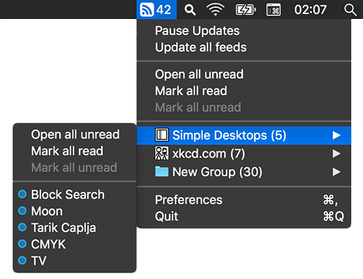

[](#download--install)
[](https://github.com/relikd/baRSS/releases)
[](https://github.com/relikd/baRSS/releases)
[](LICENSE)


baRSS – *Menu Bar RSS Reader*
=============================




What is it?
-----------

A RSS & Atom feed reader that lives in the system status bar.  
Very much inspired by [RSS Menu](https://itunes.apple.com/us/app/rss-menu/id423069534); go ahead and check that out.

*baRSS* will automatically update feeds for you, and inform you when new content is available.
The new articles are just a menu away.


### Features

*baRSS* is unobtrusive, fast, and built from scratch with minimal footprint in mind.
The application uses less than 30 Mb memory and has a ridiculous file size of 1 Mb.

Speaking of reducing web traffic.
In contrast to other applications, *baRSS* does not save any cached web sessions or cookies as a matter of fact.
But it will reuse `ETag` and `Last-Modified` headers to avoid unnecessary transmissions.
Further, tuning the update frequently will decrease the traffic even more.


Download & Install
------------------

Requires macOS Mojave (10.14) or higher.

### Easy way
Go to [releases](https://github.com/relikd/baRSS/releases) and downloaded the latest version.  
Searching for the App Store release? Read this [notice](#app-store-notice).

### Build from source
You'll need Xcode, [RSXML2] \(required), and [QLOPML] \(optional).

```sh
git clone https://github.com/relikd/baRSS
git clone https://github.com/relikd/RSXML2
git clone https://github.com/relikd/QLOPML
```

Alternatively, you can simply delete the `QLOPML` project reference without much harm.
`QLOPML` is a Quick Look plugin for `.opml` files.
It will display the file contents whenever you hit spacebar.

That's it. 
Open `baRSS/baRSS.xcodeproj` and build the project. 
Note, there are some compiler flags that append 'beta' to the development release. 
If you prefer the optimized release version go to `Product > Archive`.


Hidden options
--------------

### Launch on start / reboot

baRSS has no option to launch it on start.
However, you can still add the application to auto boot by adding it to the system login items:

`System Preferences > User > Login Items` (macOS 10.x-12)
`System Preferences > General > Login Items & Extensions` (macOS 13+)


### UI options

1. If you hold down the option key and click on an article item, you can mark a single item (un-)read without opening it.
I am still searching for a way to keep the menu open after click (if you know of a way, let me know!).

2. To add websites without RSS feed you can use the regex converter.
Hold down the option key in the feed edit modal and click the red regex button.
Though, admittedly, this is for experts only.
I still have to find a nice user-friendly way to achieve this.

3. The option “Show only unread” will hide all items which have been read.
You can hold down option key before opening the menu bar icon to show hidden articles regardless.
This is a nice way to quickly lookup a hidden article without going into settings and twiddling with the checkbox.


### CLI options

The following options have no UI equivalent and must be configured in Terminal. 
Most likely, you will never stumble upon these if not reading this chapter.
**Note:** To reset an option run `defaults delete de.relikd.baRSS {KEY}`, where `{KEY}` is an option from below.


1. When holding down the option key, the menu will show an item to open only a few unread items at a time. 
This number can be changed with the following Terminal command (default: 10):
```
defaults write de.relikd.baRSS openFewLinksLimit -int 10
```

2. In preferences you can choose to show 'Short article names'. 
This will limit the number of displayed characters to 60 (default). 
With this Terminal command you can customize this limit:
```
defaults write de.relikd.baRSS shortArticleNamesLimit -int 50
```

3. Each article menu item shows a summary tooltip (if the server provides one).
By default, the tooltip is limited to 2000 characters.
You can change the limit with this command:
```
defaults write de.relikd.baRSS articleTooltipLimit -int 500
```

3. Limit the number of displayed articles per feed menu.
**Note:** displayed unread count may be different than the unread items inside. 'Open all unread' will open hidden items too.
```
defaults write de.relikd.baRSS articlesInMenuLimit -int 40
```

4. You can change the appearance of colors throughout the application. 
E.g., The tint color of the menu bar icon and the color of the blue unread articles dot.
```
defaults write de.relikd.baRSS colorStatusIconTint -string "#37F"
defaults write de.relikd.baRSS colorUnreadIndicator -string "#FBA33A"
```

5. To backup your list of subscribed feeds, here is a one-liner:
```
open barss:backup && cp "$HOME/Library/Containers/de.relikd.baRSS/Data/Library/Application Support/baRSS/backup/feeds_latest.opml" "$HOME/Desktop/baRSS_backup_$(date "+%Y-%m-%d").opml"
```


ToDo
----

The following list is a collection of ideas that may be added if people request it.

- [ ] Localizations
- [x] Feed generator for websites without feeds
- [ ] Automatically choose best update interval (e.g., avg)
- [ ] Sync with online services
- [ ] Feeds with authentication
- [x] Notification Center
- [ ] Distraction Mode
	- [ ] Distract less: Sleep timer. (e.g., disable updates during working hours)
	- [ ] Distract more: Automatically open feed items
- [ ] Add support for media types
	- [ ] music / video? (open media player)
	- [ ] Pure image feed? (show images directly in menu)
- [ ] Per feed / group settings
	- [ ] select launch application (e.g., for podcasts)
	- [ ] exclude unread count from menu bar (e.g., unimportant feeds)
- [ ] ~~Infinite storage. (load more button)~~


FAQ / Q&A
---------

### App Store Notice

If you find this app somewhere on the App Store, you can be sure that it is a counterfeit.
As long as you can read this very notice, I am not responsible for the publication.
Further, I can't guarantee the App Store version wasn't modified by a malicious actor to spy on you.


### Why create something that already existed?

First, open source is awesome!
Second, RSS Menu made some design decisions I didn't like.
For example, the new integrated browser window.

One thing I liked most, was the fact that feeds were opened in the default browser.
Not like 99% of the other feed readers on the market that show a separate HTML viewer window.
No rendering issues, no broken links, no content that is different from the actual news article.

I know, the whole purpose of RSS is to deliver content without the need of opening a webpage.
But for me RSS is more about being informed whenever a blog or news feed has updated content.
E.g, subscribing to video channels without having to have an account.


### Why is this project not written in Swift?!

Actually, I started this project with Swift.
Even without adding much functionality, the app was exceeding the 10 Mb file size.
The working alpha version, written in Objective-C, had only 500 Kb.
The reason being that Swift frameworks are always packed into the final application.

Sadly, this was before Swift 5 and ABI stability.
Had I only started the project a year later…
But on the other hand, now it is macOS 10.12 compatible.

### 3rd Party Libraries

This project uses a modified version of Brent Simmons' [RSXML] for feed parsing. 
[RSXML2] is licensed under a MIT license (same as this project).


##### Trivia

- Start of project: __July 19, 2018__
- Estimated development time: __2053h+__
- First prototype used __feedparser python__ library


[QLOPML]: https://github.com/relikd/QLOPML
[RSXML2]: https://github.com/relikd/RSXML2
[RSXML]: https://github.com/brentsimmons/RSXML
