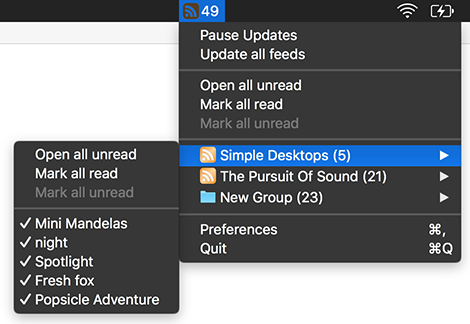

# baRSS – *Menu Bar RSS Reader*

For nearly a decade I've been using the then free version of [RSS Menu](https://itunes.apple.com/us/app/rss-menu/id423069534). However, with the release of macOS Mojave, 32bit applications are no longer supported. Furthermore, the currently available version in the Mac App Store was last updated in 2014 (as of writing).

*baRSS* was build from scratch with a minimal footprint in mind. It will be available on the AppStore eventually. If you want a feature to be added, drop me an email or create an issue. Look at the other issues, in case somebody else already filed one similar. If you like this project and want to say thank you drop me a line (or other stuff like money). Regardless, I'll continue development as long as I'm using it on my own. Admittedly, I've invested way too much time in this project already (1200h+) …

Why is this project not written in Swift?
-----------------------------------------

Actually, I started this project with Swift. Even without adding much functionality, the app was exceeding the 10 Mb file size. Compared to the nearly finished Alpha version with 500 Kb written in Objective-C. The reason for that, Swift frameworks are always packed into the final application. I decided that this level of encapsulation is a waste of space for such a small application.

3rd Party Libraries
-------------------

This project uses a modified version of Brent Simmons [RSXML](https://github.com/brentsimmons/RSXML) for feed parsing. RSXML is licensed under a MIT license (same as this project).

Current project state
---------------------

All basic functionality is there. What's missing? 

- Authenticated feeds
- Online sync with other services
- Automatic feed detection (e.g., YouTube)
- Text / UI localisation

All in all, the software is in a usable state. The remaining features will be added in the coming weeks.

ToDo
----

- [ ] Edit feed
	- [ ] Show statistics
		- [x] How often gets the feed updated (min, max, avg)
		- [ ] Automatically choose best interval?
		- [x] Show time of next update
	- [ ] Feeds with authentication

- [ ] Other
	- [ ] App Icon
	- [ ] Translate text to different languages
	- [x] Download with ephemeral url session?
	- [ ] Add Sandboxing
		- [ ] Disable Startup checkbox (or other workaround)

- [ ] Additional features
	- [ ] Sync with online services!
	- [ ] Notification Center
	- [ ] Sleep timer. (e.g., disable updates during working hours)
	- [ ] Pure image feed? (show images directly in menu)
	- [ ] ~~Infinite storage. (load more button)~~
	- [ ] Automatically open feed items?
	- [ ] Per feed launch application (e.g., for podcasts)
		- [ ] Per group setting to exclude unread count from menu bar

